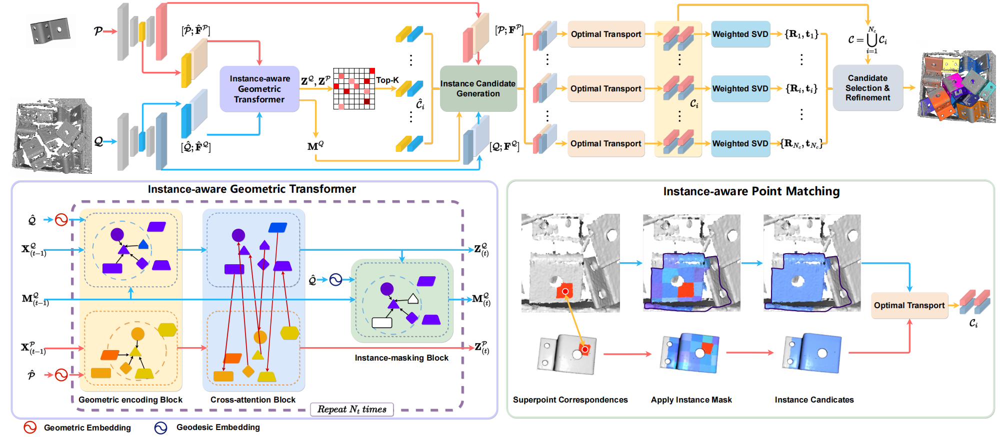

# Learning Instance-Aware Correspondences for Robust Multi-Instance Point Cloud Registration in Cluttered Scenes

PyTorch implementation of the paper:

[Learning Instance-Aware Correspondences for Robust Multi-Instance Point Cloud Registration in Cluttered Scenes](https://arxiv.org/abs/2404.04557).

Zhiyuan Yu, Zheng Qin, Lintao Zheng, and Kai Xu.

Email:yuzhiyuan317@gmail.com
## Introduction

Multi-instance point cloud registration estimates the poses of multiple instances of a model point cloud in a scene point cloud. Extracting accurate point correspondences is to the center of the problem. Existing approaches
usually treat the scene point cloud as a whole, overlooking the separation of instances. Therefore, point features could be easily polluted by other points from the background or different instances, leading to inaccurate correspondences oblivious to separate instances, especially in cluttered scenes. In this work, we propose MIRETR, Multi-Instance REgistration TRansformer, a coarse-to-fine approach to the extraction of instance-aware correspondences. At the coarse level, it jointly learns instance-aware superpoint features and predicts per-instance masks. With instance masks, the influence from outside of the instance being concerned is minimized, such that highly reliable superpoint correspondences can be extracted. The superpoint correspondences are then extended to instance candidates at the fine level according to the instance masks. At last, an efficient candidate selection and refinement algorithm is devised to obtain the final registrations. Extensive experiments on three public benchmarks demonstrate the efficacy of our approach. In particular, MIRETR outperforms the state of the arts by 16.6 points on F1 score on the challenging ROBI benchmark.


## Installation

MIRETR is tested on Python 3.7, Ubuntu 18.04,
Install MIRETR with the following command:

```bash
# It is recommended to create a new environment
conda create -n MIRETR python==3.7
conda activate MIRETR
# Install packages and other dependencies
pip install -r requirements.txt
python setup.py build develop
```


## robi

### Data preparation
You need to pre-download dataset [ROBI](https://www.trailab.utias.utoronto.ca/robi), [ScanNet](https://github.com/ScanNet/ScanNet), [ShapeNet](https://www.shapenet.org/) and [Scan2CAD](https://github.com/skanti/Scan2CAD). 

```text
--data--robi
            |--Object_models--Zigzag.stl
                |      |        
                |      |--...
            |--Zigzag--Scene_1
                |      |        
                |      |--...
            |--Gear--Scene_1
                |      |              
                |      |--...
```  

```text
--scan2cad_download
        |--benchmark_input_files--cad_appearances_hidden_testset.json
                                |--scannet_hidden_testset.csv
        |--cad_appearances.json
        |--full_annotations.json
        |--unique_cads.csv
        
```  
### Training

The code for robi is in `release/robi`. Use the following command for training.

```bash
cd MIRETR
CUDA_VISIBLE_DEVICES=0 python release/robi/trainval.py
```

### Testing

The code for robi is in `release/robi`. Use the following command for testing.

```bash
cd MIRETR
CUDA_VISIBLE_DEVICES=0 python release/robi/test.py
```
We provide pretrained weights in https://drive.google.com/drive/folders/14dFeMda_zt0r2pC-NjnpLsZGeJ9fpD3o?usp=drive_link.
## Acknowledgements

- [RPMNet](https://github.com/yewzijian/RPMNet)
- [CoFiNet](https://github.com/haoyu94/Coarse-to-fine-correspondences)
- [huggingface-transformer](https://github.com/huggingface/transformers)
- [SuperGlue](https://github.com/magicleap/SuperGluePretrainedNetwork)
- [vision3d](https://github.com/qinzheng93/vision3d)
- [Geotransformer](https://github.com/qinzheng93/GeoTransformer)
- [ROBI_Toolkit](https://github.com/junyang224/ROBI_Toolkit)

